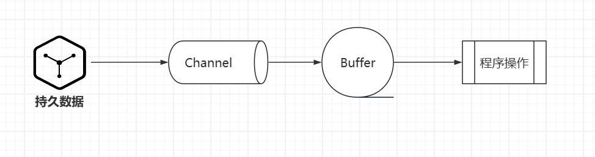
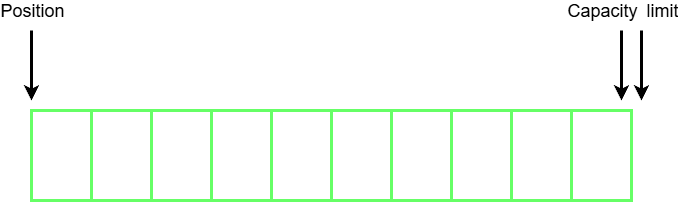
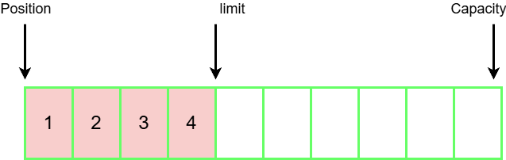
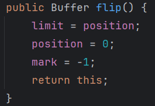
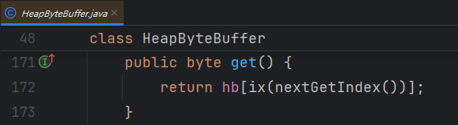
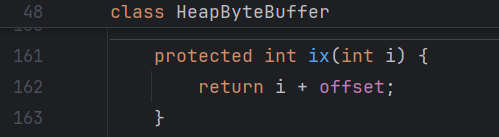
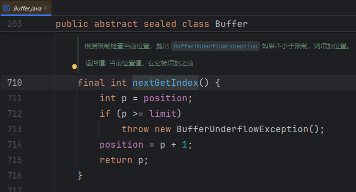
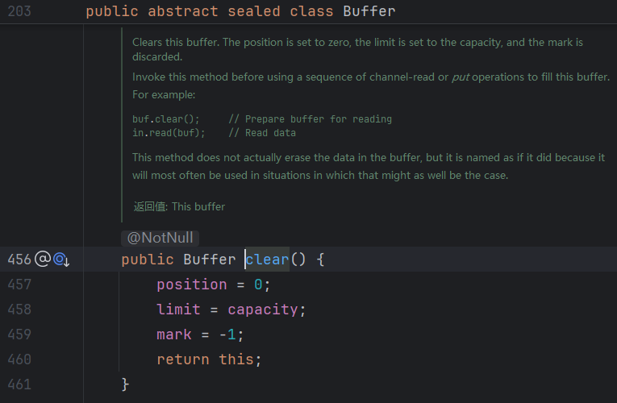
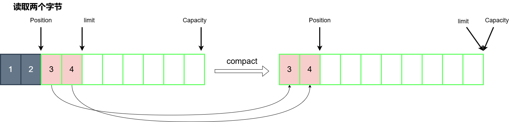
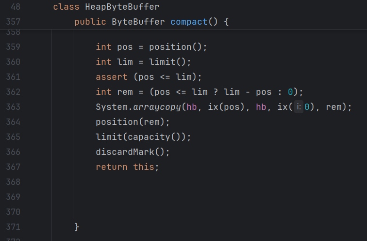

# NIO
non-blocking io 非阻塞IO
## 三大组件
- Channel
- Buffer
- Selector
### Channel & Buffer
Channel 是数据读写的双向通道, 可以将数据与 buffer 双向读写
buffer 数据缓冲区, 程序读入的数据可以存储在缓冲区

Channel的数据可以从文件或者网络流中读取, 读取后写入到缓冲区, 程序获取到数据其实是与buffer交互获取到的



```java
public static void main(String[] args) {
    URL resource = ByteBufferTest.class.getResource("/data.txt");
    assert resource != null;
    try (
            FileInputStream fileInputStream = new FileInputStream(resource.getFile());
            // 从流中获取通道
            FileChannel channel = fileInputStream.getChannel()
    ) {
        // 申请缓冲区, 新申请的缓冲区位置为0, 可以进行写操作 -- HeapByteBuffer
        ByteBuffer buffer = ByteBuffer.allocate(10);
        // 将管道中的内容写入缓冲区
        int len = channel.read(buffer);
        while (len >= 0) {
            // 因为写操作, 此时指针不在缓冲区的起始位置, 需要翻转一下才可以从头开始读
            buffer.flip();
            // hasRemaining -- 判断是否有元素可以读取
            while (buffer.hasRemaining()) {
                byte b = buffer.get();
                System.out.println(((char) b));
            }
            // 清除缓冲区内容并调整指针到起始位置
            buffer.clear();
            len = channel.read(buffer);
        }
    } catch (IOException e) {
        e.printStackTrace();
    }
}
```

常见的channel有:

- FileChannel
- DatagramChannel: UDP
- SocketChannel: TCP (client/server)
- ServerSocketChannel: TCP (server)

常见buffer有:

- ByteBuffer: 以字节为单位(abstract)
  - MappedByteBuffer
  - DirectByteBuffer
  - HeapByteBuffer
- ShortBuffer
- IntBuffer
- LongBuffer
- FloatBuffer
- DoubleBuffer
- CharBuffer

### Selector

Selector是一个选择器, 管理多个channel, 用于帮线程决策应该处理哪个Channel. 有Selector和非阻塞模式下的channel的存在, 一个线程就可以实现同时处理多个IO的能力, 最大程度的压榨线程和CPU性能

**多线程服务器缺陷**

传统的多线程服务器为每个请求都分配了一个线程, 虽然Java支持多线程, 但是线程数过多也会导致内存溢出.

同时也存在缺点就是CPU的处理能力上限会导致多个线程之间频繁发生上下文切换, 浪费请求处理时间,降低响应速度

也就是说多线程服务器的使用场景是**连接数较少**的场景

**线程池服务器缺陷**

线程池版就是使用线程池管理一定量的线程, 避免线程过多导致的内存溢出和频繁上下文切换, 表现为线程池中的一个线程处理多个不同的连接请求(socket)

阻塞模式下, 一个线程只能处理一个socket连接

也就是说线程池服务器的使用场景是在**短连接**, 线程池也是比较适合http请求的, 也是早期Tomcat采用的策略

**Selector对这些缺陷的设计**

一个Selector和一个线程绑定, 并且管理多个Channel, 当Channel发生对应的事件后, Selector可以接收到并让线程执行对应的任务, 而且Channel采用非阻塞的方式工作, 这样就不会握死thread进行等到, 大大提高线程的利用率.也可以降低服务器对线程数量的需求.

采用Selector的服务器适合的场景是**连接多而流量低**(low traffic)

> selector的select()方法会阻塞直到Channel发生读写就绪事件, selector就是通过接收到这些事件再让thread处理
>
> 
>
> 线程池一个线程处理多个请求是在阻塞模式下, 而Selector管理的Channel是工作在非阻塞模式下的, 线程池中的线程还是需要等到当前线程执行完(可以看作一个请求被响应)后才能执行其他的线程任务

## ByteBuffer

### ByteBuffer的使用方式

NIO中的Buffer和ByteBuffer都是抽象类

```java
public abstract sealed class Buffer
    permits ByteBuffer, CharBuffer, DoubleBuffer, FloatBuffer, IntBuffer,
        LongBuffer, ShortBuffer {
    ...
}
```

```java
public abstract sealed class ByteBuffer
    extends Buffer
    implements Comparable<ByteBuffer>
    permits
    HeapByteBuffer, MappedByteBuffer
{
    ...
}
```

而ByteBuffer的构造器都被控制为包私有

```java
// Creates a new buffer with the given mark, position, limit, capacity,
// backing array, and array offset
//
ByteBuffer(int mark, int pos, int lim, int cap,   // package-private
             byte[] hb, int offset, MemorySegment segment)
{
    super(mark, pos, lim, cap, segment);
    this.hb = hb;
    this.offset = offset;
}

// Creates a new buffer with the given mark, position, limit, and capacity
//
ByteBuffer(int mark, int pos, int lim, int cap, MemorySegment segment) { // package-private
    this(mark, pos, lim, cap, null, 0, segment);
}

// Creates a new buffer with given base, address and capacity
//
ByteBuffer(byte[] hb, long addr, int cap, MemorySegment segment) { // package-private
    super(addr, cap, segment);
    this.hb = hb;
    this.offset = 0;
}
```

也就是说我们无法通过new来创建ByteBuffer, 要获取ByteBuffer可以通过静态方法 `allocate(int capacity)`, 得到一个`HeapByteBuffer`

如果能够成功申请到HeapByteBuffer起始位置都是0, 可以正常进行写操作

写操作就可以通过连接到持久化文件的channel进行read,  `channel.read(buffer)`

read方法默认会将整个缓冲区填充满(如果通道内的数据量足够大的情况下), 同时也可以指定要写入的字节大小

写入缓冲区后缓冲区的pos位置指针会根据写入的字节数移动, 需要将缓冲区的pos指针重新调整到开头位置才能读取到内容, 重置位置指针的方法为 `flip()`, 这个过程也被叫做切换缓冲区为读模式

通过buffer的`get(...)`方法可以在缓冲区中读取到内容并转为java类型, get默认读取的是一个字节的内容

在读取完内容后位置指针又会偏移到缓冲区的末尾, 需要使用 `clear()` 方法清空缓冲区并重置位置指针, 这样缓冲区就可以重新写入数据了, 这个过程也被叫做切换缓冲区为写模式

总结顺序:

1. 从持久化获取channel

2. 使用缓冲区的静态方法allocate申请缓冲区

3. 通过channel的read方法将channel的数据写入缓冲区

4. 使用buffer的flip重置位置指针将缓冲区切换为读模式

5. 使用buffer的get方法获取数据

6. 获取数据后使用clear清空缓冲区重置位置指针, 也可以使用compact方法将未读取的数据调整到缓冲区开头

   > compact的位置指针还是偏移在缓冲区未读数据后, 可以正常写, 但是前面的内容不能直接读, 缓冲区还是可能存在数据的
   >
   > ```java
   > public ByteBuffer compact() {
   >     int pos = position();
   >     int lim = limit();
   >     assert (pos <= lim);
   >     int rem = (pos <= lim ? lim - pos : 0);
   >     System.arraycopy(hb, ix(pos), hb, ix(0), rem);
   >     position(rem);
   >     limit(capacity());
   >     discardMark();
   >     return this;
   > }
   > ```

#### 位置指针操作

读取缓冲区的数据后, 位置指针会发生偏移导致已经读取的数据不能再读取, 如果想要再次从头开始读, 需要使用 `rewind()` 方法,将位置指针重置到0

```java
public Buffer rewind() {
    position = 0;
    mark = -1;
    return this;
}
```

注意, `rewind`方法只能实现将位置指针修改到开头, 不能灵活的控制位置指针

在 `Buffer` 类中, 还有一个成员属性 `mark`, 这个字段的作用是为位置指针做标记, 方便在必要的时候使用 `reset()` 直接将位置指针重置回标记的位置

```java
public abstract sealed class Buffer
    permits ByteBuffer, CharBuffer, DoubleBuffer, FloatBuffer, IntBuffer,
        LongBuffer, ShortBuffer {
    // Invariants: mark <= position <= limit <= capacity
    private int mark = -1;
    private int position = 0;
    private int limit;
    private final int capacity;
}
```

mark字段使用实例:

```java
ByteBuffer buffer = ByteBuffer.allocate(10);	// 申请10字节缓冲区
buffer.put(new byte[]{'a', 'b', 'c', 'd'});		// 往缓冲区写入四个字符
buffer.flip();									// 切换缓冲区为读模式(位置指针归0)
System.out.println((char)buffer.get());			// a
System.out.println((char)buffer.get());			// b
buffer.mark();									// 为当前位置指针做一个标记c
System.out.println((char)buffer.get());			// c
System.out.println((char)buffer.get());			// d
buffer.reset();									// 将位置指针调整到标记的位置
System.out.println((char)buffer.get());			// c
System.out.println((char)buffer.get());			// d
```

此外, 还有一个get(int pos)方法, 直接获取到指定位置上的字节内容, 这个方法不会影响 position 指针的值

### ByteBuffer的结构

ByteBuffer的父类 `Buffer` 中有两个很重要的属性 `position`  和 `limit`, 与 `ByteBuffer` 类的 `capacity` 属性十分重要.

```java
public abstract sealed class Buffer
    permits ByteBuffer, CharBuffer, DoubleBuffer, FloatBuffer, IntBuffer,
        LongBuffer, ShortBuffer {

    // Invariants: mark <= position <= limit <= capacity
    private int mark = -1;
    private int position = 0;
    private int limit;
    private final int capacity;
}
```

```java
public abstract sealed class ByteBuffer
    extends Buffer
    implements Comparable<ByteBuffer>
    permits
    HeapByteBuffer, MappedByteBuffer

{
    // Cached array base offset
    private static final long ARRAY_BASE_OFFSET = UNSAFE.arrayBaseOffset(byte[].class);

    // These fields are declared here rather than in Heap-X-Buffer in order to
    // reduce the number of virtual method invocations needed to access these
    // values, which is especially costly when coding small buffers.
    //
    final byte[] hb;                  // Non-null only for heap buffers
    final int offset;
    boolean isReadOnly;
}
```

- position: 位置指针, 对缓冲区的操作都是由pos指针来控制位置
- limit: 写入限制
- capacity: 容量

一开始创建(申请)缓冲区的时候, 位置指针就是在起始位置(0), 而写入限制limit和capacity容量相同, 都处在缓冲区末尾位置



往缓冲区写入数据后pos指针会随着写入字节数移动, 调用flip()后, buffer会将limit修改为pos指针所在的位置, 并将pos重新调整到起始位置. 这样一来, 读取操作就会被limit限制在有效数据范围内



```java
// Buffer
public Buffer flip() {
    limit = position;
    position = 0;
    mark = -1;
    return this;
}
```



读取的时候会使得position指针不断偏移, 在偏移的时候也会同步检查是否超过limit指针, 超过limit则会抛出异常

pos指针偏移发生在每次获取数据访问下标的时候发生的, 该方法的定义在 `Buffer` 中

下面是get方法的相关源码

```java
// ByteBuffer
final byte[] hb;
// HeapByteBuffer
public byte get() {
    return hb[ix(nextGetIndex())];
}
protected int ix(int i) {
    return i + offset;
}
// Buffer
final int nextGetIndex() {// package-private
    int p = position;
    if (p >= limit)
        throw new BufferUnderflowException();
    position = p + 1;
    return p;
}
```







使用clear方法清空缓冲区后, 会将pos重置到起始位置并将limit移回末尾, 因为缓冲区被清空也没有读取的意义, 所以此时缓冲区的模式变为写模式




除了clear方法外还有一个compact方法, 可以清除掉已经被读取的数据, 让未读取的数据覆盖已读取的位置, 并修改limit到缓冲区末尾等待重新写入



限制指针抵达缓冲区末尾, 在pos和limit之间存在多个空余空间不可读取, 所以此时的缓冲区是一个写模式



> 读取缓冲区数据可以使用get(), 需要注意get()方法的特性就是会使指针向后移动
>
> 而get(int i) 可以获取指定位置上的内容并且不移动指针
>
> 同时还有一个rewind方法可以将position重置为0

### ByteBuffer的类别

ByteBuffer有两个实现类分别为:

- HeapByteBuffer
- DirectByteBuffer

**HeapByteBuffer** 

HeapByteBuffer在Java堆内存中分配, 受到垃圾回收影响, 读写效率相比较低

**DirectByteBuffer**

DirectByteBuffer在直接内存(系统内存)中分配, 读写效率较高(少一次拷贝)

但是DirectByteBuffer是系统内存, JVM需要调用系统函数申请内存,申请速度较慢, 而不受垃圾回收影响使用不当的话会导致内存溢出

### 字符串转ByteBuffer

要使用字符串构建 ByteBuffer 可以使用下列API:

- 往已创建的 ByteBuffer 对象中 put 进字节数组

  > ```java
  > ByteBuffer buffer = ByteBuffer.allocate(10);
  > buffer.put("hello".getBytes())
  > ```
  >
  > 填充完数组如果要获取内容需要使用flip将缓冲区转为读模式
  >
  > ```java
  > ByteBuffer buffer = ByteBuffer.allocate(10);
  > buffer.put("中文".getBytes());
  > bufbufferfer2.flip();
  > System.out.println("buffer = " + StandardCharsets.UTF_8.decode(buffer));
  > ```
  >
  > ```java
  > ByteBuffer buffer2 = ByteBuffer.allocate(10);
  > buffer2.put("中文".getBytes(StandardCharsets.UTF_8));
  > buffer2.flip();
  > System.out.println("buffer2 = " + StandardCharsets.UTF_8.decode(buffer2));
  > ```

- 使用Charsets的encode(string)生成ByteBuffer

  > ```java
  > ByteBuffer buffer3 = StandardCharsets.UTF_8.encode("hello");
  > ```

- 使用ByteBuffer的静态方法warp()

  > ```java
  > ByteBuffer buffer = ByteBuffer.wrap("hello".getBytes());
  > ```

### 分散读&集中写

在使用 `FileChannel` 和 `ByteBuffer` 读取文件内容时, 可以可以采用多个缓冲区提升效率, 在读操作时使用 多个ByteBuffer同时接收文件内容

在写操作时, channel中接收多个buffer一次性写入

```java
import java.io.IOException;
import java.io.RandomAccessFile;
import java.nio.ByteBuffer;
import java.nio.channels.FileChannel;
import java.nio.charset.StandardCharsets;
import java.util.Objects;

/**
 * 分散读取文件中的内容
 *
 * 将读取的内容分散到做个缓冲区中, 可以同时操作多个缓冲区内容提升效率
 */
public class TestScattingRead {
    public static void main(String[] args) {
        try (FileChannel fileChannel = new RandomAccessFile(Objects.requireNonNull(TestScattingRead.class
                .getResource("/worlds.txt")).getFile(),
                "r").getChannel()) {
            ByteBuffer buffer1 = ByteBuffer.allocate(3);
            ByteBuffer buffer2 = ByteBuffer.allocate(3);
            ByteBuffer buffer3 = ByteBuffer.allocate(5);
            fileChannel.read(new ByteBuffer[]{buffer1, buffer2, buffer3});
            buffer1.flip();
            buffer2.flip();
            buffer3.flip();
            System.out.println("buffer1: " + StandardCharsets.UTF_8.decode(buffer1));
            System.out.println("buffer2: " + StandardCharsets.UTF_8.decode(buffer2));
            System.out.println("buffer3: " + StandardCharsets.UTF_8.decode(buffer3));
        } catch (IOException ioException) {
            ioException.printStackTrace();
        }
    }
}
```

```java
import java.io.IOException;
import java.io.RandomAccessFile;
import java.nio.ByteBuffer;
import java.nio.channels.FileChannel;
import java.nio.charset.StandardCharsets;

/**
 * 集中写
 * 通过管道(FileChannel)一次性将多个 ByteBuffer 的内容写入文件
 */
public class TestGatheringWrite {
    public static void main(String[] args) {
        ByteBuffer buffer1 = StandardCharsets.UTF_8.encode("hello");
        ByteBuffer buffer2 = StandardCharsets.UTF_8.encode("world");
        ByteBuffer buffer3 = StandardCharsets.UTF_8.encode("中文");

        try (FileChannel channel = new RandomAccessFile(
                "world2.txt",
                "rw").getChannel()) {
            channel.write(new ByteBuffer[]{buffer1, buffer2, buffer3});
        } catch (IOException e) {
            e.printStackTrace();
        }
    }
}
```
