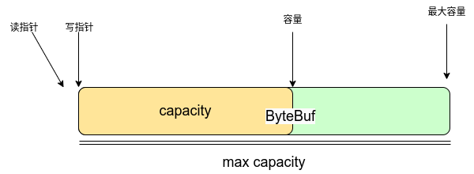

# 一. C/S

## 1.1 服务器创建

Netty创建服务器使用 `ServerBootstrap` 类来组装,

`ServerBootstrap` 是一个服务器启动类, 可以组装服务器所需的所有组件, 创建启动类后要给定一个事件循环组来处理服务器连接事件以及处理连接的通道类型, 最重要的是指定读写事件发生时应该做什么操作, 最后绑定特定端口即可

- 给定事件循环组通过 `.group(EventLoopGroup)` 完成

- 指定处理连接通道类型通过 `.channel(class)` 完成

- 处理读写事件使用 `childHandler(ChannelHandler)` 完成

  channelHandler通常使用抽象类 `ChannelInitializer<T>`实现initChannel方法完成, 泛型为连接成功后的通道类型, `NioServerSocketChannel`对应的就是`NioSocketChannel`

  > childHandler 不能直接处理读写事件, 需要通过netty的channel中的pipeline来完成, 一个childHandler可以拥有多个pipeline对一条消息进行多次处理
  >
  > 在ChannelInitializer类的initChannel方法可以得到channel, 调用channel.pipeline()可以获得管道并添加或删除

下面是一个简单的服务器实例, 服务器接收一个消息后通过UTF-8编码然后由第二个处理器完成消息的日志推送

```java
import io.netty.bootstrap.ServerBootstrap;
import io.netty.channel.ChannelHandlerContext;
import io.netty.channel.ChannelInboundHandlerAdapter;
import io.netty.channel.ChannelInitializer;
import io.netty.channel.nio.NioEventLoopGroup;
import io.netty.channel.socket.nio.NioServerSocketChannel;
import io.netty.channel.socket.nio.NioSocketChannel;
import io.netty.handler.codec.string.StringDecoder;
import lombok.extern.slf4j.Slf4j;

/**
 * @author spirit
 * @since 2024-09
 */
@Slf4j
public class NettyBasicServer {
    public static void main(String[] args) {
        // server launch, assemble netty module
        new ServerBootstrap()
        // group include boss and worker(selector, thread), boss process accept, worker process read/write
        .group(new NioEventLoopGroup())
        // using server socket channel as boss, it is nio mode, but not jdk nio, it belongs to netty
        .channel(NioServerSocketChannel.class)
        // appoint what should worker do
        // this initializer can create channel, in initializer add some channel to process read/write
            .childHandler(new ChannelInitializer<NioSocketChannel>() {
            @Override
            protected void initChannel(NioSocketChannel channel) throws Exception {
                // stringDecoder will change ByteBuf to java.lang.String (ByteBuf belongs to netty)
                channel.pipeline().addLast(new StringDecoder());
                // add consume handler to handle read with ChannelInBoundHandler
                channel.pipeline().addLast(new ChannelInboundHandlerAdapter() {
                    @Override
                    public void channelRead(ChannelHandlerContext ctx, Object msg) throws Exception {
                        log.info("msg is [{}]", msg);
                    }
                });
            }
        })
        .bind(8088);
    }
}
```

## 1.2 客户端创建

实际上, Netty创建的客户端不需要使用Netty实现的客户端来连接, 任何基于传输层协议的连接都可以完成(TCP/UDP).

如果要使用Netty创建客户端, 代码与服务器创建类似, 只需要将服务器类型转为客户端类型即可

1. 使用客户端启动类创建启动器

   > 客户端启动类为Bootstrap, JDK中也有一个类加载器名为Bootstrap

2. 指定事件循环组

3. 指定启动类中的通道类型

4. 添加处理器

   > 这里的处理器添加方法使用的是handle而不是服务器的childHandle

```java
import io.netty.bootstrap.Bootstrap;
import io.netty.channel.ChannelInitializer;
import io.netty.channel.nio.NioEventLoopGroup;
import io.netty.channel.socket.nio.NioSocketChannel;
import io.netty.handler.codec.string.StringEncoder;

import java.net.InetSocketAddress;

/**
 * @author spirit
 * @since 2024-09
 */
public class NettyBasicClient {
    public static void main(String[] args) throws InterruptedException{
        // client launcher
        new Bootstrap()
        .group(new NioEventLoopGroup())
        // appoint worker class
        .channel(NioSocketChannel.class)
        // add handler, it will invoke after connecting
        .handler(new ChannelInitializer<NioSocketChannel>() {
            @Override
            protected void initChannel(NioSocketChannel ch) throws Exception {
                // because server has string decoder, so here need to add string encoder
                // to make sure message coding is the same
                ch.pipeline().addLast(new StringEncoder());
            }
        })
        .connect(new InetSocketAddress("127.0.0.1", 8088))
        // blocking until connection was established
        .sync()
        // get connection channel to send message to server
        .channel().writeAndFlush("hello, world!");
    }
}
```

# 二. 组件

## 2.1 EventLoop

eventLoop是Netty中真正的事件执行者, 是一个单线程的执行器, 实现了JUC的Executor接口并提供一个run方法具备线程运行能力, 并且在内部持有一个selector来处理执行的任务. 

EventLoop 一定会绑定到一个特定的线程

EventLoop接口继承netty的`OrderedEventExecutor`接口, `OrderedEventExecutor`接口继承JUC包中的 `ScheduledExecutorService`接口, 使得 EventLoop 具备JUC提供的多线程定时任务执行能力 与 netty 提供的判断线程与 EventLoop 关系的能力.

- isEventLoop(Thread thread) 判断线程是否属于 EventLoop

- parent 可以获取到所属的 EventLoopGroup

EventLoop使用主要有两类:

- NioEventLoop: 能够处理 io 事件, 定时任务与普通任务
- DefaultEventLoop: 没有处理io事件的能力

NioEventLoop的构造器是包私有的, 通常在使用EventLoop都是通过Group来完成

即使用 `EventLoopGroup`. EventLoop 既可以充当处理连接的BOSS也可以充当处理读写的Worker, 在创建EventLoopGroup时如果不指定数量, 会创建出多个EventLoop, 并让不同的EventLoop处理不同的事件.

不指定数量时, 会按照机器的核心数来决定, 以 `NioEventLoopGroup` 为例

```java
public class NioEventLoopGroup extends MultithreadEventLoopGroup {
    public NioEventLoopGroup() {
        // 空参数时传递0, 在父类构造时进行处理
        this(0);
    }
    public NioEventLoopGroup(int nThreads, Executor executor, final SelectorProvider selectorProvider,
                             final SelectStrategyFactory selectStrategyFactory) {
        super(nThreads, executor, selectorProvider, selectStrategyFactory, RejectedExecutionHandlers.reject());
    }
}

public abstract class MultithreadEventLoopGroup extends MultithreadEventExecutorGroup implements EventLoopGroup {
    // 默认事件循环线程数
    private static final int DEFAULT_EVENT_LOOP_THREADS;

    static {
        // 至少一个, 默认为机器CPU核心数*2
        DEFAULT_EVENT_LOOP_THREADS = Math.max(1, SystemPropertyUtil.getInt(
                "io.netty.eventLoopThreads", NettyRuntime.availableProcessors() * 2));

        if (logger.isDebugEnabled()) {
            logger.debug("-Dio.netty.eventLoopThreads: {}", DEFAULT_EVENT_LOOP_THREADS);
        }
    }
    
    protected MultithreadEventLoopGroup(int nThreads, Executor executor, Object... args) {
        super(nThreads == 0 ? DEFAULT_EVENT_LOOP_THREADS : nThreads, executor, args);
    }
}
```

空参数创建的`EventLoopGroup`线程数为 **机器核心数*2**

下面是 EventLoop 的处理普通任务和定时任务的方式

```java
// show how to use EventLoop handle task and schedule task
import io.netty.channel.EventLoop;
import io.netty.channel.EventLoopGroup;
import io.netty.channel.nio.NioEventLoopGroup;
import lombok.extern.slf4j.Slf4j;

import java.util.concurrent.TimeUnit;

/**
 * using event loop to process default task and schedule task
 * @author spirit
 * @since 2024-09
 */
@Slf4j
public class EventLoopRunTask {
    public static void main(String[] args) {
        // create EventLoop, use EventLoop need by group.
        // NioEventLoopGroup can process io event,schedule task, default task
        // DefaultEventLoopGroup can not process io event
        EventLoopGroup group = new NioEventLoopGroup(2);
        // EventLoopGroup group = new NioEventLoopGroup();
        // EventLoopGroup group2 = new DefaultEventLoopGroup();

        // get event loop by next() and process default task
        log.info("first EventLoop: [{}]", group.next());
        log.info("second EventLoop: [{}]", group.next());
        log.info("third EventLoop: [{}]", group.next());
        log.info("fourth EventLoop: [{}]", group.next());

        // invoke default task by submit() or execute()
        EventLoop eventLoop = group.next();
        eventLoop.submit(() -> {
            log.info("submit by event loop (running default task)");
        });

        // eventLoop interface extended ScheduledExecutorService, so it can invoke schedule task
        // invoke schedule task with scheduleAtFixedRate() or scheduleAtFixedDelay()
        // delay one seconds log row message
        group.next().scheduleAtFixedRate(()->{
            log.info("schedule by event loop (running schedule task)");
        }, 0, 1, TimeUnit.SECONDS);

        // thread of event loop run task not the same as main
        log.info("main thread");
    }
}
```

使用 NioEventLoop 处理 IO 的方式与服务器创建的方式类似

```java
import io.netty.bootstrap.ServerBootstrap;
import io.netty.buffer.ByteBuf;
import io.netty.channel.ChannelHandlerContext;
import io.netty.channel.ChannelInboundHandlerAdapter;
import io.netty.channel.ChannelInitializer;
import io.netty.channel.nio.NioEventLoopGroup;
import io.netty.channel.socket.nio.NioServerSocketChannel;
import io.netty.channel.socket.nio.NioSocketChannel;
import lombok.extern.slf4j.Slf4j;

import java.nio.charset.StandardCharsets;

/**
 * using nioEventLoop to process io event as a server
 * @author spirit
 * @since 2024-09
 */
@Slf4j
public class EventLoopProcessIO {
    public static void main(String[] args) {
        new ServerBootstrap()
                .group(new NioEventLoopGroup(2))
                .channel(NioServerSocketChannel.class)
                // every time client connected, server will make one channel binding in eventLoop.
                // one client for one channel, channel binding to eventLoop
                // event loop run with singly thread can make sure handle io event is concurrency safe.
                // if the number of client connection more than the number of eventLoopGroup thread
                // Multiplexing use one event loop(one thread) handle multiple connection(channel)
                .childHandler(new ChannelInitializer<NioSocketChannel>() {
                    @Override
                    protected void initChannel(NioSocketChannel ch) throws Exception {
                        ch.pipeline().addLast(new ChannelInboundHandlerAdapter() {
                            @Override
                            public void channelRead(ChannelHandlerContext ctx, Object msg) throws Exception {
                                // if never process msg, it will be a ByteBuf.
                                // add String Decoder before this pipeline, msg will be a java.lang.String
                                ByteBuf buf = (ByteBuf) msg;
                                log.info("buf is [{}]", buf.toString(StandardCharsets.UTF_8));
                                log.info("channel is [{}]", ctx.channel());
                            }
                        });
                    }
                }).bind(8088);

        log.info("server is running");
    }
}
```

值得注意的是, 创建服务器时会使用 NioEventLoop 完成连接请求, 连接建立后会有一个新的 channel 为 NioSocketChannel, `NioSocketChannel` 绑定到由

```java
.group(new NioEventLoopGroup(2))
```

创建出来的NioEventLoopGroup中的NioEventLoop. 

每个NioEventLoop也会绑定到一个特定的线程来处理, netty会尝试使用不同的NioEventLoop来处理读写达到负载均衡的目的, 但是在连接数超过给定的Group线程数量时, 将有多个 NioSocketChannel 被绑定到 同一个 NioEventLoop 上, 类似于一个线程处理多个channel.

这样处理的好处是, 一个线程单独处理一个连接的IO, 不会产生竞态条件导致多线程安全问题, 也无需为资源处理进行锁控制, 减少上下文切换等耗时操作同时避免死锁的可能.

## 2.2 Channel

channel 的主要作用:

- close() 用来关闭channel
- closeFuture() 处理channel的关闭
  - sync 同步等待channel关闭
  - addListener 异步等待channel关闭
- pipeline 添加处理器
- write 将数据写入channel(不一定发送)
- writeAndFlush 写入数据并发送(刷出)

回顾客户端代码

```java
new Bootstrap()
.group(new NioEventLoopGroup())
.channel(NioSocketChannel.class)
.handler(new ChannelInitializer<NioSocketChannel>() {
    @Override
    protected void initChannel(NioSocketChannel ch) throws Exception {
        ch.pipeline().addLast(new StringEncoder());
    }
})
.connect(new InetSocketAddress("127.0.0.1", 8088))
.sync()
.channel().writeAndFlush("hello, world!");
```

在客户端创建, 连接服务器后调用了 `sync` 方法, 这个方法将会阻塞, 知道实际连接成功, 如果不调用该方法, 在connect方法执行连接请求后就会走到 `channel`方法直接获取到一个channel, 由于网络连接建立需要时间, 此时获取到的channel是一个未连接状态的channel, 直接执行 writeAndFlush 会导致数据丢失, 服务器未能正常接收到数据

> connect方法返回的是一个ChannelFuture接口, sync 和 channel方法都属于该接口

sync是一个阻塞方法, 如果不想客户端阻塞, 可以采用 ChannelFuture 接口的 addListener 方法, 为ChannelFuture添加监听器, 类似回调函数, 在特定的时机执行监听器内容

```java
ChannelFuture channelFuture = new Bootstrap()
    .group(new NioEventLoopGroup())
    .channel(NioSocketChannel.class)
    .handler(new ChannelInitializer<NioSocketChannel>() {
        @Override
        protected void initChannel(NioSocketChannel ch) throws Exception {
            ch.pipeline().addLast(new StringEncoder(StandardCharsets.UTF_8));
        }
    })
    // connect 返回 ChannelFuture 接口对象
    .connect(new InetSocketAddress("localhost", 8088));

// 为 ChannelFuture 添加监听器, 在连接完成后由nio线程执行回调内容
channelFuture.addListener(new ChannelFutureListener() {
    @Override
    public void operationComplete(ChannelFuture future) throws Exception {
        Channel channel = future.channel();
        channel.writeAndFlush("Hello World");
    }
});
```

sync方法是将整个过程进行阻塞, 将异步变为同步

监听器方法是保持异步性, 在特定的时机执行回调, 回调的内容将由另外的线程即 nio 线程进行处理

### channel关闭处理

现在设计一个客户端, 用于接收用户的输入, 并且在用户每次输入完成按下回车后都可以将数据发送到服务器, 并在按下 'q' 时退出

```java
@Slf4j
public class SendIOClient {
    public static void main(String[] args) {
        // create client, and get channel future by connect method.
        NioEventLoopGroup group = new NioEventLoopGroup();
        ChannelFuture clientConnectFuture = new Bootstrap()
                .group(group)
                .channel(NioSocketChannel.class)
                .handler(new ChannelInitializer<NioSocketChannel>() {
                    @Override
                    protected void initChannel(NioSocketChannel ch) throws Exception {
                        ch.pipeline().addLast(new LoggingHandler(LogLevel.DEBUG));
                        ch.pipeline().addLast(new StringEncoder(StandardCharsets.UTF_8));
                    }
                }).connect(new InetSocketAddress("localhost", 8088));

        // get channel by client channel future.
        Channel channel = clientConnectFuture.channel();
        // after connecting, create new thread receive user input
        // and put input message to server util user input 'q'.
        // add listener for client connect future, this listener will listen connect event
        // (after connect method connecting successful)
        clientConnectFuture.addListener(new ChannelFutureListener() {
            @Override
            public void operationComplete(ChannelFuture future) throws Exception {
                log.info("connect success, run scanner in input thread");
                group.next().submit(()->{
                    while (true){
                        Scanner input = new Scanner(System.in);
                        String line = input.nextLine();
                        if ("q".equals(line)) {
                            channel.close();
                            break;
                        }
                        channel.writeAndFlush(line);
                    }
                });
            }
        });
    }
}
```

在上面的实现中, 通过 connect 方法连接成功得到一个 `ChannelFuture`, 并且绑定了一个监听器, 每次连接成功时会在 `EventLoopGroup` 中取出一个执行器, 类似一个线程来接收用户输入, 当用户输入的内容是 'q' 时, 将该连接的通道关闭.

但是通道关闭后整个程序并不会停下, 因为在创建  NIOEventLoopGroup 的时候同时创建出来了多个线程, 连接通道关闭了但是仍然后很多线程在执行, 需要连同整个eventLoopGroup一起关闭才可以.

如果在if语句块中执行group关闭操作会有一个问题, 执行接收用户输入的是group中的一个执行器, 而close方法是一个异步方法, 如果想在通道关闭完成后再执行相应的善后工作并不能保证都是在close完成之后再执行的, 例如打印一个程序关闭的日志, 这个日志可能出现在close方法执行完成之前

```
22:53:13.076 [nioEventLoopGroup-2-2] INFO  cc.sika.netty.channel.SendIOClient - close channel and exit
22:53:13.076 [nioEventLoopGroup-2-1] DEBUG io.netty.handler.logging.LoggingHandler - [id: 0x5aa15679, L:/127.0.0.1:6072 - R:localhost/127.0.0.1:8088] CLOSE
```

想要真正完成善后工作, 需要通过该连接成功的channel对象的 `closeFuture` 方法得到一个 `ChannelFuture` 接口并将代码阻塞为同步, 等待成功关闭后再执行善后工作

```java
// closeFuture method mean gives you future, you can deal shutdown task after channel being closed,
ChannelFuture channelFuture = channel.closeFuture();
try {
	// blocking main thread by closeFuture's sync method until channel closes success
	channelFuture.sync();
	log.info("after closing, now process shutdown task...");
} catch (InterruptedException e) {
	throw new RuntimeException(e);
}
```

这种方式将阻塞整个main线程执行, 不符合nio思想

netty提供了监听器回调的方式, 避免阻塞代码, 同样是在连接成功的channel对象调用  `closeFuture` 得到 `ChannelFuture` 并为该 future 添加监听器

```java
// note: just close channel, client has not been shutdown. because NioEventLoopGroup has other thread.
// NioEventLoopGroup's shutdownGracefully method can
// make all the thread in NioEventLoopGroup be shutdown
// after thread task completing
channel.closeFuture().addListener(new ChannelFutureListener() {
    @Override
    public void operationComplete(ChannelFuture future) throws Exception {
        log.info("after closing, now process shutdown task...");
        group.shutdownGracefully();
    }
});
```

该监听器的`operationComplete`方法逻辑会在通道真正关闭之后被执行.

## 2.3 Future & Promise

### JUC--Future

JUC包提供一个 Future 接口, 用于获取线程的任务执行状态, 主要与线程池和 callback 接口搭配使用.

```java
import java.util.concurrent.*;

/**
 * show how to use java.util.concurrent.Future with thread pool
 * @author spirit
 * @since 2024-09
 */
@Slf4j
public class JDKFuture {
    public static void main(String[] args) {
        // create thread pool
        ExecutorService pool = Executors.newFixedThreadPool(2);

        log.info("submit task");
        Future<Integer> future = pool.submit(new Callable<Integer>() {
            public Integer call() throws Exception {
                Thread.sleep(2000);
                return 1;
            }
        });
        log.info("waiting result");
        // future's get method is blocking, it will block until task complete
        // so here need to wait for task complete (2000ms)
        try {
            log.info("result is {}", future.get());
        } catch (InterruptedException|ExecutionException e) {
            throw new RuntimeException(e);
        }
        pool.shutdown();
    }
}
```

future通过get方法, 阻塞等待直到任务完成返回计算结果

### Netty--Future

netty也提供一个Future接口, 扩展 JUC 的Future接口, 添加监听器相关功能方法, 判断成功失败相关方法, 等待以及将代码同步化相关方法以及获取结果的getNow()

```java
package io.netty.util.concurrent;

import java.util.concurrent.CancellationException;
import java.util.concurrent.TimeUnit;

public interface Future<V> extends java.util.concurrent.Future<V> {
    boolean isSuccess();
    boolean isCancellable();
    Throwable cause();
    Future<V> addListener(GenericFutureListener<? extends Future<? super V>> listener);
    Future<V> addListeners(GenericFutureListener<? extends Future<? super V>>... listeners);
    Future<V> removeListener(GenericFutureListener<? extends Future<? super V>> listener);
    Future<V> removeListeners(GenericFutureListener<? extends Future<? super V>>... listeners);
    Future<V> sync() throws InterruptedException;
    Future<V> syncUninterruptibly();
    Future<V> await() throws InterruptedException;
    Future<V> awaitUninterruptibly();
    boolean await(long timeout, TimeUnit unit) throws InterruptedException;
    boolean await(long timeoutMillis) throws InterruptedException;
    boolean awaitUninterruptibly(long timeout, TimeUnit unit);
    boolean awaitUninterruptibly(long timeoutMillis);
    /**
     * Return the result without blocking. If the future is not done yet this will return {@code null}.
     *
     * As it is possible that a {@code null} value is used to mark the future as successful you also need to check
     * if the future is really done with {@link #isDone()} and not rely on the returned {@code null} value.
     */
    V getNow();
    @Override
    boolean cancel(boolean mayInterruptIfRunning);
}
```

因为netty提供的future接口增加了监听器相关功能, 所以可以使用监听器避免线程阻塞问题

```java
import io.netty.channel.EventLoop;
import io.netty.channel.EventLoopGroup;
import io.netty.channel.nio.NioEventLoopGroup;
import io.netty.util.concurrent.Future;
import io.netty.util.concurrent.GenericFutureListener;
import lombok.extern.slf4j.Slf4j;

/**
 * show how to use io.netty.util.concurrent.Future with EventLoopGroup(as thread pool)
 * @author spirit
 * @since 2024-09
 */
@Slf4j
public class NettyFuture {
    public static void main(String[] args) {
        // create event loop group(like thread pool)
        EventLoopGroup group = new NioEventLoopGroup();
        EventLoop eventLoop = group.next();

        log.info("submit task");
        Future<Integer> nettyFuture = eventLoop.submit(() -> {
            Thread.sleep(1000);
            return 1;
        });
        log.info("waiting for result");

        // netty's future is blocking
        // it has to wait for task completing and return result
        /*try {
            log.info("result is {}", nettyFuture.get());
        } catch (ExecutionException | InterruptedException e) {
            throw new RuntimeException(e);
        }*/

        // use listener and future's getNow method to obtain the task result asynchronously
        nettyFuture.addListener(new GenericFutureListener<Future<? super Integer>>() {
            @Override
            public void operationComplete(Future<? super Integer> future) throws Exception {
                log.info("result is {}", future.getNow());
            }
        });

        // shutdown all thread in group
        group.shutdownGracefully();
    }
}
```

### Netty--Promise

Netty设计Promise继承自io.netty.util.concurrent.Future, 添加设置成功或失败的标记能力

```java
package io.netty.util.concurrent;
public interface Promise<V> extends Future<V> {
    Promise<V> setSuccess(V result);
    boolean trySuccess(V result);
    Promise<V> setFailure(Throwable cause);
    boolean tryFailure(Throwable cause);
    boolean setUncancellable();
}
```

通过设置成功和失败可以结合监听器发挥更加灵活的能力

```java
import io.netty.channel.EventLoop;
import io.netty.channel.nio.NioEventLoopGroup;
import io.netty.util.concurrent.DefaultPromise;
import io.netty.util.concurrent.Future;
import io.netty.util.concurrent.GenericFutureListener;
import lombok.extern.slf4j.Slf4j;


/**
 * show how to use io.netty.util.concurrent.Promise.
 * @author spirit
 * @since 2024-09
 */
@Slf4j
public class NettyPromise {
    public static void main(String[] args) {
        // create pool
        NioEventLoopGroup loopGroup = new NioEventLoopGroup();
        // get executor (thread)
        EventLoop eventLoop = loopGroup.next();
        // promise need one executor to run task
        DefaultPromise<Integer> promise = new DefaultPromise<>(eventLoop);

        // use another thread to simulate task, after completing it need to put result to promise
        loopGroup.next().submit(()->{
            log.info("starting task");
            try {
                Thread.sleep(1000);
                int i = 1/0;
                promise.setSuccess(23);
            } catch (Exception e) {
                // put error message
                promise.setFailure(e);
            }
        });

        log.info("waiting result...");
        // the get method is from JDK's Future interface, so it is blocking
//        try {
//            log.info("result is {}", promise.get());
//        } catch (InterruptedException | ExecutionException e) {
//            throw new RuntimeException(e);
//        }

        // Promise interface extend netty's Future, so it has addListener method
        // use listener can avoid synchronized
        promise.addListener(new GenericFutureListener<Future<? super Integer>>() {
            @Override
            public void operationComplete(Future<? super Integer> future) throws Exception {
                if (future.isSuccess()) {
                    log.info("future.get() is {}", future.get());
                    log.info("promise.get() is {}", promise.get());
                }
                else {
                    log.error("promise.get() failed");
                    log.error("failure cause", future.cause());
                }

            }
        });

        loopGroup.shutdownGracefully();
    }
}
```

## 2.4 Handler & Pipeline

## 2.5 ByteBuf

### 创建ByteBuf

ByteBuf创建需要通过 `ByteBufAlloactor` 接口的`buffer()`方法分配。

```java
ByteBuf buff = ByteBufAllocator.DEFAULT.buffer();
```

这种方式分配出来的缓冲器是默认容量为256的可变缓冲区`PooledUnsafeDirectByteBuf`。

```java
import io.netty.buffer.ByteBuf;
import io.netty.buffer.ByteBufAllocator;
import lombok.extern.slf4j.Slf4j;

import java.nio.charset.StandardCharsets;

/**
 * alloc ByteBuf
 * @author spirit
 * @since 2024-09
 */
@Slf4j
public class ByteBufCreator {
    public static void main(String[] args) {
        ByteBuf buff = ByteBufAllocator.DEFAULT.buffer();

        log.info("buff = {}", buff);
        
        StringBuilder builder = new StringBuilder();
        for (int i = 0; i < 300; i++) {
            builder.append("a");
        }

        buff.writeBytes(builder.toString().getBytes(StandardCharsets.UTF_8));
        log.info("buff = {}", buff);
    }
}
```

结果为:

```shell
21:52:28.980 [main] INFO  cc.sika.netty.buf.ByteBufCreator - buff = PooledUnsafeDirectByteBuf(ridx: 0, widx: 0, cap: 256)
21:52:28.988 [main] INFO  cc.sika.netty.buf.ByteBufCreator - buff = PooledUnsafeDirectByteBuf(ridx: 0, widx: 300, cap: 512)
```

### 直接内存&堆内存

调用分配器接口的`buffer()`方法得到的ByteBuf是直接内存。想要得到基于堆内存的ByteBuf可以使用`heapBuffer()` 方法得到。

如果想要更加语义化的直接内存申请，可以使用`directBuffer()` 方法申请。

直接内存和堆内存的缓冲区都有各自的优缺点：

- 直接内存创建和销毁的代价昂贵，但读写性能高(少一次内存复制)，适合配合池化功能一起使用
- 直接内存对GC压力小，因为这部分内存不受JVM垃圾回收管理，但也要注意及时主动释放

```java
import io.netty.buffer.ByteBuf;
import io.netty.buffer.ByteBufAllocator;
import lombok.extern.slf4j.Slf4j;

/**
 * @author spirit
 * @since 2024-09
 */
@Slf4j
public class DifferenceByteBufCreator {
    public static void main(String[] args) {
        ByteBuf heapBuffer = ByteBufAllocator.DEFAULT.heapBuffer();
        ByteBuf directBuffer = ByteBufAllocator.DEFAULT.directBuffer();

        log.info("heap Buffer = {}", heapBuffer);
        log.info("direct Buffer = {}", directBuffer);
    }
}
```

得到的结果为：

```java
22:06:21.724 [main] INFO  cc.sika.netty.buf.DifferenceByteBufCreator - heap Buffer = PooledUnsafeHeapByteBuf(ridx: 0, widx: 0, cap: 256)
22:06:21.726 [main] INFO  cc.sika.netty.buf.DifferenceByteBufCreator - direct Buffer = PooledUnsafeDirectByteBuf(ridx: 0, widx: 0, cap: 256)
```

### 池化&非池化

直接内存的申请和销毁都是很耗时的操作，而池化可以让缓冲区具备可重用的能力从而减少不必要的系统开销，如果没有池化，堆内存受GC影响也会相对浪费性能。

在Netty中采用 `jemalloc`， 类似的内存分配算法提升分配效率，在高并发场景下池化更加节约内存也能够很好内存溢出问题出现

池化功能默认启用，可以通过系统环境变量来指定开启或禁用：
```shell
-Dio.netty.allocator.type={unpooled|pooled}
```

在Netty4.1版本后默认启用池化并且在安卓平台下会关闭池化。

在ByteBufUtil中核心代码体现为：
```java
static final ByteBufAllocator DEFAULT_ALLOCATOR;

static {
    String allocType = SystemPropertyUtil.get(
            "io.netty.allocator.type", PlatformDependent.isAndroid() ? "unpooled" : "pooled");

    ByteBufAllocator alloc;
    if ("unpooled".equals(allocType)) {
        alloc = UnpooledByteBufAllocator.DEFAULT;
        logger.debug("-Dio.netty.allocator.type: {}", allocType);
    } else if ("pooled".equals(allocType)) {
        alloc = PooledByteBufAllocator.DEFAULT;
        logger.debug("-Dio.netty.allocator.type: {}", allocType);
    } else if ("adaptive".equals(allocType)) {
        alloc = new AdaptiveByteBufAllocator();
        logger.debug("-Dio.netty.allocator.type: {}", allocType);
    } else {
        alloc = PooledByteBufAllocator.DEFAULT;
        logger.debug("-Dio.netty.allocator.type: pooled (unknown: {})", allocType);
    }

    DEFAULT_ALLOCATOR = alloc;

    THREAD_LOCAL_BUFFER_SIZE = SystemPropertyUtil.getInt("io.netty.threadLocalDirectBufferSize", 0);
    logger.debug("-Dio.netty.threadLocalDirectBufferSize: {}", THREAD_LOCAL_BUFFER_SIZE);

    MAX_CHAR_BUFFER_SIZE = SystemPropertyUtil.getInt("io.netty.maxThreadLocalCharBufferSize", 16 * 1024);
    logger.debug("-Dio.netty.maxThreadLocalCharBufferSize: {}", MAX_CHAR_BUFFER_SIZE);
}
```

### 组成

ByteBuf由四部分组成，分别为读写指针、容量与最大容量。

初始申请ByteBuf时会拥有一个容量[capacity]默认256，读写指针都在0的位置，当往ByteBuf中插入数据时写指针会移动，超过容量后会自动扩容，为了让ByteBuf不超过内存容量，还会有一个最大容量限制。



往ByteBuf中写入数据时，写指针往后移动，读指针与写指针中间的区域为可读数据，读取数据后读指针也会移动，读取过的区域称为废弃部分。

>  最大容量默认为 2147483647

### 常用方法

ByteBuf的常用方法有

| 方法签名                                                | 含义                 | 备注                                           |
| ------------------------------------------------------- | -------------------- | ---------------------------------------------- |
| writeBoolean(boolean value)                             | 写入boolean值        | 用一个字节01\|00代表true\|false                |
| writeByte(int value)                                    | 写入byte值           |                                                |
| writeShort(int value)                                   | 写入short            |                                                |
| writeInt(int value)                                     | 写入int值            | Big Endian，即0x250，写入后 `00 00 02 50`      |
| writeIntLE(int value)                                   | 写入int值            | Little Endian，即0x250，写入后为 `50 02 00 00` |
| writeLong(long value)                                   |                      |                                                |
| writeChar(int value)                                    |                      |                                                |
| writeFloat(float value)                                 |                      |                                                |
| writeDouble(double value)                               |                      |                                                |
| writeBytes(ByteBuf src)                                 | 将netty的ByteBuf写入 |                                                |
| writeBytes(byte[] src)                                  | 将字节数组写入       |                                                |
| writeBytes(ByteBUffer src)                              | 写入nio的ByteBuffer  |                                                |
| writeCharSequence(CHarSequence string, Charset charset) | 写入字符串           |                                                |

### 释放

netty的ByteBuf类实现 `ReferenceCounted` 接口，为引用计数器对象，在每次使用完ByteBuf之后都需要调用 `release()` 方法释放。

release方法会让缓冲器的引用计数减一，如果引用计数达到0会将对象释放掉.

- UnpooledHeapByteBuf 使用的是JVM内存，只需等GC回收内存即可
- UnpooledDirectByteBuf 使用直接内存，需要特殊的方法回收内存
- PooledByteBuf 和它的子类使用池化技术，需要更复杂的规则回收内存

通常情况下使用ByteBuf都是在handler中创建，并且一次入栈或者出栈都会存在多个处理器，可能在某个环节中处理好了ByteBuf，传递给下一个处理器时已经不是传递ByteBuf对象，此时就需要将ByteBuf释放。但是也不能在每次使用（每个处理器）中释放ByteBuf。

#### 零拷贝--slice[切片]

slice意为切片，可以将一个缓冲区ByteBuf切为多个片段，但是slice不会触及数据拷贝，也就被称为零拷贝。

slice是为原有的ByteBuf添加标记，将一个ByteBuf切割为多个分片，使用的是同个物理内存，只是通过多个ByteBuf对象在逻辑上对ByteBuf做逻辑切片。

切片后会生成一个新的ByteBuf对象，但是使用的还是与原ByteBuf对象同一份内存，修改切片后的新对象也会导致源缓冲区内容被修改。

```java
import io.netty.buffer.ByteBuf;
import io.netty.buffer.ByteBufAllocator;
import lombok.extern.slf4j.Slf4j;

import java.nio.ByteBuffer;
import java.nio.charset.StandardCharsets;

/**
 * @author spirit
 * @since 2024-09
 */
@Slf4j
public class ByteBufSlice {
    public static void main(String[] args) {
        ByteBuf byteBuf = ByteBufAllocator.DEFAULT.directBuffer();

        byteBuf.writeBytes(new byte[]{'a','b','c','d','e','f','g','h','i','j'});
        byte[] bytes = new byte[byteBuf.readableBytes()];
        byteBuf.getBytes(0, bytes, 0, bytes.length);
        // now, byteBuf is [a, b, c, d, e, f, g, h, i, j]
        log.info("byteBuf's content = {}", byteAyyToChar(bytes));

        ByteBuf slice1 = byteBuf.slice(0, 5);
        byte[] bytes1 = new byte[5];
        slice1.getBytes(0, bytes1, 0, bytes1.length);
        ByteBuf slice2 = byteBuf.slice(5, 5);
        byte[] bytes2 = new byte[5];
        slice2.getBytes(0, bytes2, 0, bytes2.length);
        // slice1 is [a, b, c, d, e]
        log.info("slice1's content = {}", byteAyyToChar(bytes1));
        // slice2 is [f, g, h, i, j]
        log.info("slice2's content = {}", byteAyyToChar(bytes2));

        // change first character to '1' of slice1, see whether character was changed of byteBuf
        slice1.setByte(0, '1');
        log.info("after change slice1");
        bytes = new byte[byteBuf.readableBytes()];
        byteBuf.getBytes(0, bytes, 0, byteBuf.readableBytes());
        // byteBuf = [1, b, c, d, e, f, g, h, i, j]
        log.info("byteBuf = {}", byteAyyToChar(bytes));
        bytes1 = new byte[5];
        slice1.getBytes(0, bytes1, 0, bytes1.length);
        // slice1 = [1, b, c, d, e]
        log.info("slice1 = {}", byteAyyToChar(bytes1));
        bytes2 = new byte[5];
        slice2.getBytes(0, bytes2, 0, bytes2.length);
        // slice2 = [f, g, h, i, j]
        log.info("slice2 = {}", byteAyyToChar(bytes2));
    }
}
```

切片后得到的ByteBuf对象与直接申请到的对象不同，切片后的对象最大容量会被直接定死，避免空间不够时自动扩容导致的一系列问题。

> 第一个切片扩容后，操作第一个切片的内容导致源缓冲区中属于切片2的内容被修改

切片后的缓冲区对象内存属于源缓冲区的内存，如果对源缓冲区调用`release`方法释放掉了内存，也会导致切片后的ByteBuf不能访问该内存。

在每次切片后都建议调用一次`retain`方法让缓冲区的计数器加1，在切片使用完后手动调用`release`避免使用到已经被释放的缓冲区。

```java
public static void main(String[] args) {
    ByteBuf byteBuf = ByteBufAllocator.DEFAULT.directBuffer();

    byteBuf.writeBytes(new byte[]{'a','b','c','d','e','f','g','h','i','j'});
    byte[] bytes = new byte[byteBuf.readableBytes()];
    byteBuf.getBytes(0, bytes, 0, bytes.length);
    // now, byteBuf is [a, b, c, d, e, f, g, h, i, j]
    log.info("byteBuf's content = {}", byteAyyToChar(bytes));

    ByteBuf slice1 = byteBuf.slice(0, 5);
    slice1.retain();
    byte[] bytes1 = new byte[5];
    slice1.getBytes(0, bytes1, 0, bytes1.length);
    ByteBuf slice2 = byteBuf.slice(5, 5);
    slice2.retain();
    byte[] bytes2 = new byte[5];
    slice2.getBytes(0, bytes2, 0, bytes2.length);
    // slice1 is [a, b, c, d, e]
    log.info("slice1's content = {}", byteAyyToChar(bytes1));
    // slice2 is [f, g, h, i, j]
    log.info("slice2's content = {}", byteAyyToChar(bytes2));

    // change first character to '1' of slice1, see whether character was changed of byteBuf
    slice1.setByte(0, '1');
    log.info("after change slice1");
    bytes = new byte[byteBuf.readableBytes()];
    byteBuf.getBytes(0, bytes, 0, byteBuf.readableBytes());
    // byteBuf = [1, b, c, d, e, f, g, h, i, j]
    log.info("byteBuf = {}", byteAyyToChar(bytes));
    bytes1 = new byte[5];
    slice1.getBytes(0, bytes1, 0, bytes1.length);
    // slice1 = [1, b, c, d, e]
    log.info("slice1 = {}", byteAyyToChar(bytes1));
    bytes2 = new byte[5];
    slice2.getBytes(0, bytes2, 0, bytes2.length);
    // slice2 = [f, g, h, i, j]
    log.info("slice2 = {}", byteAyyToChar(bytes2));
    slice1.release();
    slice2.release();
    byteBuf.release();
}
```

#### 零拷贝--composite[合并]

如果创建多个缓冲区并通过链式调用将多个缓冲区的内容写入到一个，可以达到数据合并的效果，但是会产生多次数据拷贝(取决合并的缓冲区数量).

netty提供`CompositeByteBuf`, 让该缓冲区具备数据合并的能力并且不会产生数据拷贝。

只需要对 `CompositeByteBuf` 对象调用 `addComponents` 方法即可完成数据合并。

```java
public class CompositeByteBufFromMultiBuffer {
    public static void main(String[] args) {
        ByteBuf byteBuf1 = ByteBufAllocator.DEFAULT.directBuffer(5);
        ByteBuf byteBuf2 = ByteBufAllocator.DEFAULT.directBuffer(5);

        byteBuf1.writeBytes(new byte[]{1, 2, 3, 4, 5});
        byteBuf2.writeBytes(new byte[]{6, 7, 8, 9, 10});

        // if we use this method, data will be copied twice.
        ByteBuf bufferByAllocate = ByteBufAllocator.DEFAULT.buffer();
        bufferByAllocate.writeBytes(byteBuf1).writeBytes(byteBuf2);

        // this method will not copy data, just combine multiple buffer
        CompositeByteBuf compositeByteBuf = ByteBufAllocator.DEFAULT.compositeBuffer();
        // first parameters decision whether write pointer will be changed
        compositeByteBuf.addComponents(true, byteBuf1, byteBuf2);
    }
}
```

